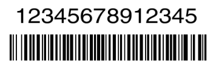

# Raspberry Pi Barcode Scanner
This is a super simple script for the Raspberry Pi (or any Linux computer, really) that will constantly wait for input from a connected barcode scanner, format it for a ZPL label printer, and send the output to the printer.  It does so by automatically logging in as the user 'pi' and running a script that "hijacks" the command line.  It is intented to be a "dumb" program that needs very little to no updating once it is set up to run.  The script and instructions are distributed under the [MIT License](license.md).  Anyone is free to use, modify, or redistribute this script.

## Setting up the environment

**Note**: These instructions were created using a Raspberry Pi 3 system running Raspbian OS.  Initial set up can be easier if you choose to install a desktop environment, but it is possible to configure everything using just command line tools.  They also assume you are logged in as the default user 'pi' and connected to the internet.  Once the system is set up and running properly, an internet connection is not needed or recommended.

Basic installation:

* Install CUPS.  By default the web-based CUPS admin only listens to internal traffic, so using a desktop environment with a browser will make installing a printer easier.
    * `sudo apt-get -y install cups`
* Allow user 'pi' to administer printers
    * `sudo usermod -a -G lpadmin pi`
* If you have not yet connected your printer via USB, do so now
    * Note:  It is strongly suggested that you **do not use a networked printer** if you intend to use this set up as-is.  The Raspberry Pi is run in a VERY insecure state and should not be left permanently connected to a network without additional security precautions.  Such precautions are outside the scope of this project.  See [Security implications](#security-implications) below for more information.
* Go to  [http://localhost:631](http://localhost:631) to install your printer.  
    * If prompted to log in, use the 'pi' username and password
    * See the [CUPS documentation](https://www.cups.org/documentation.html) for installing your printer.  I have had success with Zebra printers and choosing the (ZPL) version during installation.
    * Suggest you manually enter a simple name for the printer (such as `zebra`) to make it easier to enter later.

* Copy `printbarcode.sh` from this repo to your home directory.
    * `wget https://raw.githubusercontent.com/marksandford/Raspberry-Pi-Barcode-Scanner/master/printbarcode.sh -P ~/`
    * **Note** The script sends raw ZPL to the printer.  ZPL is highly customizable.  See below for an explanation of what the script is doing and some example alternative formats.

* Make the script executable
    * `chmod +x ~/printbarcode.sh`

* Add the printbarcode.sh script to run immediately upon login
    * `echo "~/printbarcode.sh" >> ~/.bashrc`
    * Note:  To log in as the user "pi" from now on, you will need to cancel the script by pressing CTRL+C after logging in.

* If you did not do so during intial setup, set the user pi to login automatically
    * In the Desktop
        * Go to Menu > Preferences > Raspberry Pi Configuration
        * In the System tab
            * Check Boot: To CLI
            * Check Auto-login: Log in as user 'pi'
    * Or from the command line
        * `sudo raspi-config`
        * Boot Options > Desktop/CLI
        * Choose Console Autologin

* If you want to disable wifi to save power and better secure the device (strongly recommended):
    * `sudo apt-get -y install rfkill`
    * `sudo rfkill block wifi`

## ZPL Language

Breakdown of the ZPL code generated by printbarcode.sh.  Not that {barcodeNumber} is replaced with whatever input is entered via the barcode scanner or a connected keyboard while the script is running.

### ZPL produced by printbarcode.sh as provided
`^XA~SD30^LT18^FO230,4^A0N,50,55^FD{barcodeNumber}^FS^BY2,2,50^FO220,55^BCN,50,N,N,N,N^FD{barcodeNumber}^FS^XZ`

This will result in a barcode that looks like this:

|||ZPL|Explanation|
|---|---|---|---|
|1|| ^XA|The start of a job.  Each new label will begin with this.|
|2|| ~SD30|Sets the print darkness to 30|
|3|| ^LT18|Lower the top of the label by 18 dots.  Tweak this if the printing begins too close or too far away from the top edge of the barcode label.|
|4||| The following block of commands is necessary to print the human readable numerals (interpretation line in ZPL speak) in a custom sized font.  If you want to simply use the default, uncentered interpretation line, change the values on item 6 and delete the items in 4a-4e.|
||4a| ^FO230,4|Defines the beginning of a new field at 230 dots to the right, 4 dots down.  Tweak this as needed|
||4b| ^A0N,50,55 | Sets the font to scalable, size is 50 dots high by 55 dots wide|
||4c| ^FD| Field Data.  Indicates that the next set of characters is to be printed|
||4d| {barcodeNumber} | Whatever is entered into the terminal via keyboard or scanner|
||4e| ^FS | Denotes the end of the Field|
|5|| ^BY2,2,50 | Sets the values for the barcode font: 2 dots wide, wide to narrow bar ratio of 2 (doesn't affect all barcode types), 50 dots high.  Adjust the "50" here to make the barcode taller.|
|6|| ^FO220,55 | Defines the beginning of the field that will contain the barcode font.  It starts at 220 dots from the left edge of the label, and 55 dots down from the top.  Note that this is relative from the upper corner of the label, not any previous Fields, so you can have overlap.  Adjust the 220 to move the barcode left or right, and the 55 to move it up and down the label.|
|7|| ^BCN,50,N,N,N,N | Code 128 barcode.  ^BC determines that the printer will print out in Code 128.See the docs (linked below) for a full description, but note that the first two "N"s after the 50 indicate (in order)|
||||The interpretation line should not be printed (in this case because we are already printing it in block 4a-4e).  Change to Y to print the interpretation line in default font. |
||||The interpretation line should not be printed above the code (eg it is printed below the code).  Change to Y if you changed the previous N to Y and want the interpretation line printed above the code|
|8|| ^FD Field Data.|Indicates that the next set of characters is to be printed|
|9|| {barcodeNumber} | Whatever is entered into the terminal via keyboard or scanner, printed out in Code 128.|
|10|| ^FS | Denotes the end of the Field|
|11|| ^XZ | Denotes the end of the label|

### ZPL Example using default interpretation line

If you remove section 4a-4e and edit section 6 to print default interpretation line, the ZPL and barcode will appear like this:

`^XA^LT18BY2,2,50^FO220,55^BCN,50,Y^FD12345678912345^FS^XZ`

**Note**:  As a fairly simple script, experienced coders should easily follow the logic of concatenation used to create the $fullzpl string ultimately sent to the printer.  This is not difficult, but may not be obvious to someone not used to generating text strings through variables in this way.

**The full documentation for ZPL II is [available here](https://www.zebra.com/content/dam/zebra/manuals/en-us/software/zplii-pm-vol1.pdf).**  It is recommended that you look over the documentation if you wish to make changes to how your barcodes appear.  For instance, it is possible to print your institution's name above or below the barcode.

Labelary provides a very useful free [online tool to test out your ZPL](http://labelary.com/viewer.html) without wasting labels.  

* **One caveat**: I have found that the positioning of the labels on the page does not match my printer.  Rather than troubleshoot that, I simply adjusted my positioning of the ^FO fields and printed a few test lables until they printed where I wanted them.  Positioning of elements relative to each other (eg interpretation line relative to Code 128) has been accurate.

## Security implications

No attempt is made to secure the Raspberry Pi's operating system.  For the script to function correctly, the user 'pi' is automatically logged in.  Someone with physical access to the device could plug in a keyboard and monitor, stop the script, and have full access to the system.

These risks are mitigated in several ways:

* After the initial installation, there is no reason for the system to connect to the internet.  Killing wifi and not connecting to an ethernet port make remote access impossible.  
* Someone would need physical access to the machine, plus a keyboard and monitor, to use it.
* These are likely to be deployed in staff areas where only known individuals will have access to them.
* The raspberry pi is a barebones system.  No unique or personal data is stored on it.  All it does is listen to the keyboard and format the barcode for printing.  

It is the user's responsibility to determine local security implications of using this system and to make any adjustements if deemed necessary.
